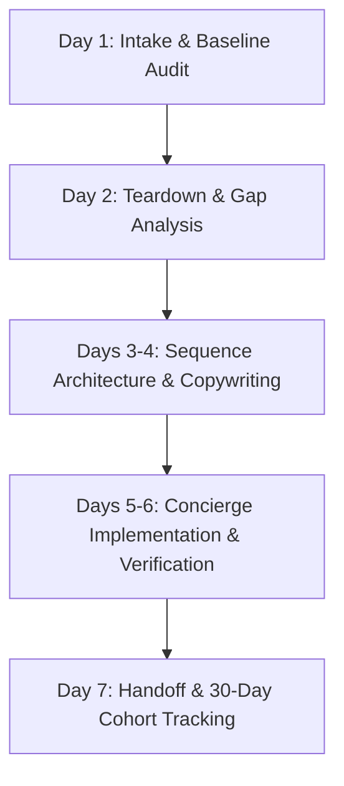
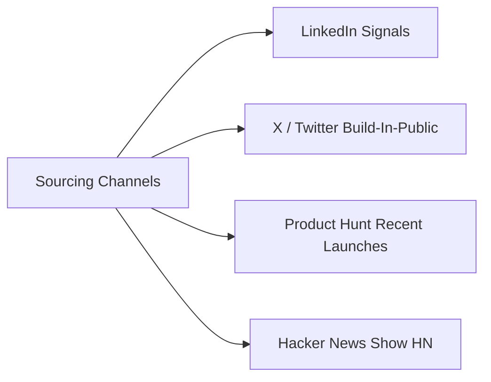
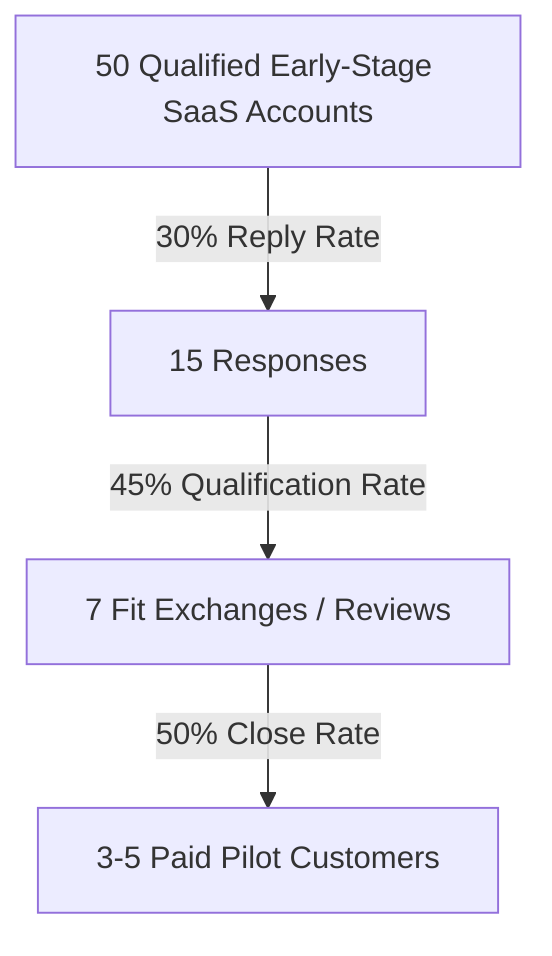

# SaaS Onboarding Email Pilot Sprint Playbook

## Overview

Early-stage SaaS founders lose paying customers in the gap between signup and product activation. Founders spend significant capital on customer acquisition, but new signups drop off because the initial email sequence is generic, missing, or disconnected from key product milestones.

This playbook establishes the manual concierge delivery workflow and targeted cold-sales outreach plan to recruit 3-5 paying pilot customers for the 7-day SaaS Onboarding Email Sprint at $300 setup.

---

## Deliverable 1: Manual Concierge Delivery Protocol

The delivery model uses concierge fulfillment without custom software dependencies. All execution occurs directly inside the client's existing tooling or through turnkey markdown templates.



### Phase 1: Intake & Baseline Audit (Day 1)
- **Tool Access or Export**: Obtain read-only access or exports from the client's current email provider (Customer.io, Loops, Resend, Postmark, Mailchimp, or ConvertKit) and product analytics (PostHog, Mixpanel, or database queries).
- **Current Sequence Audit**: Document every message sent between registration and day 14. Record trigger conditions, delay logic, and subject lines.
- **Baseline Telemetry**:
  - Weekly signup volume.
  - Open rates and click-to-open rates across existing onboarding messages.
  - Activation rate: percentage of new signups reaching the core product value event within 48 hours.
  - Free-to-paid trial conversion rate.
- **Deliverable**: Baseline Audit Snapshot document recording all current metrics and onboarding assets.

### Phase 2: Teardown & Gap Analysis (Day 2)
- **Friction Teardown**: Evaluate each message against five failure modes:
  1. Generic welcome message lacking an immediate quick-win hook.
  2. Multi-CTA confusion instead of guiding the user to a single activation step.
  3. Disconnection from in-app state (sending "how to use feature X" after the user already completed it).
  4. Passive silence when a user goes inactive during day 2 to day 5.
  5. Weak or premature trial expiration prompts.
- **Milestone Mapping**: Define the exact in-app Aha Moment that correlates with long-term customer retention.
- **Deliverable**: Onboarding Gap Analysis Report containing annotated screenshots, friction logs, and recommended sequence adjustments.

### Phase 3: Sequence Architecture & Conversion Copywriting (Days 3-4)
Draft a dedicated 5-7 part onboarding sequence written in clean, plain-text or light-HTML format optimized for primary inbox deliverability.

| Message | Trigger / Timing | Objective | Core Call to Action |
| :--- | :--- | :--- | :--- |
| **Email 1: Immediate Value Hook** | Minute 0 (instant) | Deliver login credential/confirmation and guide the user to the fastest 3-minute win. | Direct link to primary action setup. |
| **Email 2: Activation Trigger** | Hour 24 (if no core event) | Overcome the most common onboarding roadblock with a step-by-step 90-second fix. | Deep-link to the specific configuration screen. |
| **Email 3: Workflow Blueprint** | Day 3 | Share a concrete customer case study showing how a peer solved a specific bottleneck. | View workflow template or pre-built sample. |
| **Email 4: Advanced Feature Unlock** | Day 5 | Highlight one secondary leverage feature (e.g., automated exports, team invites). | Invite a colleague or connect an integration. |
| **Email 5: Founder Check-in** | Day 7 | Plain-text personal message from the founder asking what felt clunky or missing. | Direct reply to founder inbox. |
| **Email 6: Plan Conversion / Expiry** | Day 11 (or trial -3 days) | Clear breakdown of ROI, what happens to data, and risk-reversal terms. | Upgrade to annual or monthly paid tier. |
| **Email 7: Grace Extension / Exit** | Day 14 (trial end) | One-time 48-hour extension offer in exchange for product feedback. | Claim 48-hour extension or select pause. |

- **Deliverable**: Complete copy deck with subject lines, preview text, body copy, dynamic personalization tags, and fallback copy.

### Phase 4: Concierge Tool Implementation & Verification (Days 5-6)
- **In-App Staging**: Configure or update campaigns directly within the client's email service provider.
- **Segment & Trigger Configuration**:
  - Event-based exclusions: automatically suppress activation nudges once the user completes the target action.
  - User property tags: map plan tiers, signup dates, and workspace roles.
- **Deliverability & Inbox Placement Check**:
  - Inspect sender domains for SPF, DKIM, and DMARC alignment.
  - Run Litmus or Mail-tester checks to confirm spam score below 1.0.
  - Verify responsive mobile layout across iOS Mail, Gmail, and Outlook.
- **Deliverable**: Configured live campaigns in test mode or published directly to production with client approval.

### Phase 5: Handoff, Metrics Tracking & 30-Day Measurement (Day 7)
- **Handoff Documentation**: Provide a one-page operating runbook showing how to edit copy, update URLs, or adjust send cadence.
- **Cohort Tracking Sheet**: Deliver a spreadsheet template pre-configured to measure weekly signup cohorts, Day 1 activation, Day 7 retention, and paid conversion.
- **30-Day Review Scheduled**: Lock in an asynchronous or 15-minute sync 30 days post-launch to analyze lift and recommend further iterations.
- **Deliverable**: Signed-off Sprint Delivery Receipt and 30-Day Cohort Tracking Template.

---

## Deliverable 2: Paid Pilot Outreach Plan for Early-Stage SaaS Founders

### Target Persona (ICP)
- **Company Profile**: B2B SaaS, developer tools, vertical software, or workflow productivity platforms.
- **Stage**: Bootstrapped, pre-seed, or seed stage.
- **Team Size**: 2-15 employees, usually founder-led product and sales.
- **Volume**: 50-1,000 monthly signups with a self-serve or trial signup flow.
- **Primary Pain**: Free signups fail to activate, churn during the 14-day trial, or ignore automated emails.
- **Disqualification Criteria**:
  - Pre-launch products with zero user traffic.
  - Enterprise-only sales models requiring multi-month procurement cycles.
  - Consumer mobile gaming or purely transactional B2C ecommerce.

### Pilot Quota & Economic Structure
- **Pilot Quota**: Recruit 3-5 paying pilot customers.
- **Pricing**: $300 one-time setup fee (7-day delivery).
- **Risk Reversal**: 100% money-back satisfaction guarantee. If the delivered copy and staged sequence do not meet expectations, the setup fee is fully refunded upon request within 14 days.
- **Expansion Lane**: $50/month continuous retention and lifecycle optimization through 3DVR Builder plan.

### Sourcing Channels & Search Queries



1. **LinkedIn Signals**:
   - Query: `("SaaS" OR "Founder" OR "CEO") AND ("onboarding" OR "activation" OR "trial conversion" OR "signups")`
   - Secondary Signals: Founders announcing new feature releases, launch milestones, or hiring their first growth marketer.
2. **X / Twitter**:
   - Query: `("buildinpublic" OR "indiehackers") ("activation" OR "churn" OR "onboarding emails")`
   - Filter for accounts with active self-serve SaaS products.
3. **Product Hunt Launches**:
   - Filter products launched within the last 14 to 45 days in SaaS, Developer Tools, or Productivity.
   - Test the signup flow; if the welcome email is empty or generic, mark as high-conviction lead.
4. **Hacker News (Show HN)**:
   - Search: `site:news.ycombinator.com "Show HN"` filtered to recent 30 days.
   - Identify SaaS products where commenters ask usability or onboarding questions.

### 3-Stage Outreach Sequence

#### Touch 1: Signal-Based Problem Observation (Day 1)
```text
Subject: quick note on [Company] onboarding

Hi [First Name],

I signed up for [Company] earlier today to see the workspace setup. The core product makes immediate sense, but the first onboarding note had [specific observation: e.g. three different calls to action / no direct path to upload data].

When new users hit that friction point, activation typically drops before day two.

I put together a 3-bullet breakdown of where users get stuck in the first 48 hours. Would it be useful if I sent that over?

Thomas
3DVR
```

#### Touch 2: Concrete Value Teardown (Day 3)
```text
Subject: Re: quick note on [Company] onboarding

Hi [First Name],

Following up on this with the specific fix:

1. Minute 0: Replace the generic overview with one deep link straight to [Key Action].
2. Hour 24: Trigger an automated nudge only for signups who haven't completed [Key Action].
3. Day 3: Send a 120-word customer workflow example showing [Concrete Outcome].

We run a 7-day Done-For-You Onboarding Email Sprint ($300) where we rewrite the full 5-part sequence and set it up directly inside your email tool with a 100% money-back guarantee.

Are you open to running this for [Company] next week?

Thomas
```

#### Touch 3: Closing the Loop (Day 7)
```text
Subject: Re: quick note on [Company] onboarding

Hi [First Name],

Closing the loop here. If you are already refining the onboarding sequence internally, no worries at all.

If you want us to handle the full sequence architecture, copy, and tool setup for $300 next week, let me know and I will send the intake link.

Best,
Thomas
```

### Objection Handling Matrix

| Objection | Root Hesitation | Response Rationale |
| :--- | :--- | :--- |
| **"We don't have enough signups yet."** | Believes volume must precede optimization. | "When signup volume is low, every single lead is twice as expensive to lose. Fixing activation now means every future marketing dollar works." |
| **"Our engineering team will build this later."** | Deprioritizes email relative to product features. | "Engineers should focus on shipping your core product. We deliver the copy, trigger logic, and ESP setup in 7 days without pulling developer hours." |
| **"We already have automated emails."** | Assumes existing default templates are sufficient. | "Most SaaS products have automated receipts and welcome notes, but lack event-based triggers that recover stalled users before trial end." |

### Pipeline Conversion Funnel



- **50 Targeted Accounts**: Thoroughly verified for active self-serve signups.
- **15 Replies (30%)**: Maintained through verified public pain signals and zero-fluff copy.
- **7 Fit Checks (45%)**: Reviewing current email tooling and signup numbers.
- **3-5 Paid Pilots (50%)**: Closed via $300 pricing, 7-day turnaround, and full risk reversal.

### Compliance & Ethical Guardrails
- **Sender Identification**: Clear identification of sender name, company (3DVR), and valid mailing address.
- **Opt-Out Mechanism**: Every cold message contains a clear, one-click opt-out line.
- **No Spoofing / Misrepresentation**: All observations derive from actual signup inspection, never synthetic claims.
- **Daily Volume Cap**: Maximum 10 personalized prospect touches per day to ensure high signal quality.
